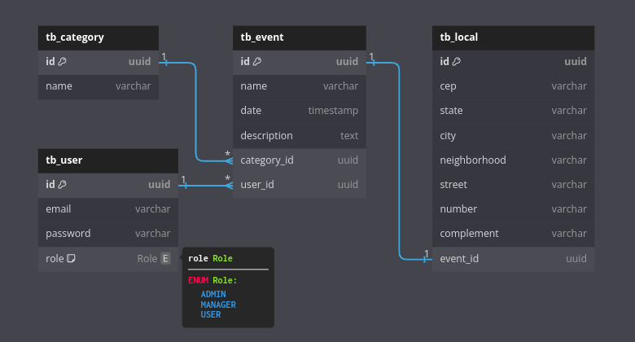

# event-manager

API de gerenciamento de eventos

## Requisitos

A API permitirá que os organizadores de eventos criem e listem, eventos, enquanto
os participantes podem explorar, pesquisar e filtrar eventos com base em categorias,
locais e datas.

## Modelagem de dados



## Recursos da API

### Eventos

 - Criar evento

   - método HTTP: **POST**

   - endpoint:

         /api/v1/events

   - restrição: **ADMIN**, **MANAGER**

   - formato da requisição:

     ```json
     {
         "name": "Event Name",
         "date": "2023-12-30",
         "description": "Event Description",
         "category": "music",
         "local": {
             "cep": "88855666",
             "state": "ST",
             "city": "City Name",
             "neighborhood": "Dummy",
             "street": "Elm",
             "number": "777",
             "complement": "Location Info" // optional
         }
     }
     ```

   - retorno:

     | Status  | Resultado |
     |:-------:|:---------:|
     | **201** | Recurso criado com sucesso          |
     | **401** | Recurso requer autenticação         |
     | **403** | Recurso requer autorização          |
     | **422** | Requisição contém valores inválidos |

 - Buscar informação sobre evento

   - método HTTP: **GET**

   - endpoint:

         /api/v1/events/{id}

   - retorno:

     | Status  | Resultado |
     |:-------:|:---------:|
     | **200** | Recurso obtido com sucesso |
     | **404** | Recurso não existe         |

 - Listar eventos

   - método HTTP: **GET**

   - endpoint:

         /api/v1/events

   - retorno:

     | Status  | Resultado |
     |:-------:|:---------:|
     | **200** | Recursos obtidos com sucesso |

   - pesquisa e filtros:

     | Pesquisa/Filtro | Parâmetro      | Tipo   | Exemplo  |
     |:---------------:|:--------------:|:------:|:--------:|
     | Nome do evento     | **eventName**    | string | /events?eventName=Some Event |
     | Data               | **date**         | string | /events?date=2023-12-25      |
     | Data (a partir de) | **startDate**    | string | /events?startDate=2023-12-25 |
     | Data (até)         | **endDate**      | string | /events?endDate=2023-12-25   |
     | Categoria          | **category**     | string | /events?category=hacking     |
     | CEP                | **cep**          | string | /events?cep=55510025         |
     | Estado             | **state**        | string | /events?state=State          |
     | Cidade             | **city**         | string | /events?city=City Name       |
     | Bairro             | **neighborhood** | string | /events?neighborhood=Dummy   |
     | Rua                | **street**       | string | /events?street=Elm           |
     | Ordernar por       | **orderBy**      | string | /events?orderBy=date         |
     | Orderm (asc, desc) | **order**        | string | /events?order=desc           |

 - Atualizar evento

   - método HTTP: **PUT**

   - endpoint:

         /api/v1/events/{id}

   - restrição: **ADMIN**, **MANAGER**

   - formato da requisição:

     ```json
     {
         "name": "New Event Name",
         "date": "2023-12-30",
         "description": "New Event Description",
         "category": "cinema",
         "local": {
             "cep": "88855666",
             "state": "ST",
             "city": "City Name",
             "neighborhood": "Dummy",
             "street": "Elm",
             "number": "888",
             "complement": "Location Info"
         }
     }
     ```

   - retorno:

     | Status  | Resultado |
     |:-------:|:---------:|
     | **200** | Recurso atualizado com sucesso      |
     | **400** | Erro ao tentar atualizar recurso    |
     | **401** | Recurso requer autenticação         |
     | **403** | Recurso requer autorização          |
     | **404** | Recurso não existe                  |
     | **422** | Requisição contém valores inválidos |

 - Remover evento

   - método HTTP: **DELETE**

   - endpoint:

         /api/v1/events/{id}

   - restrição: **ADMIN**, **MANAGER**

   - retorno:

     | Status  | Resultado |
     |:-------:|:---------:|
     | **204** | Recurso removido               |
     | **400** | Erro ao tentar remover recurso |
     | **401** | Recurso requer autenticação    |
     | **403** | Recurso requer autorização     |
     | **404** | Recurso não existe             |

### Categorias

 - Criar categoria

   - método HTTP: **POST**

   - endpoint:

         /api/v1/categories

   - restrição: **ADMIN**, **MANAGER**

   - formato da requisição:

     ```json
     {
        "name": "category name"
     }
     ```

   - retorno:

     | Status  | Resultado |
     |:-------:|:---------:|
     | **201** | Recurso criado com sucesso       |
     | **401** | Recurso requer autenticação      |
     | **403** | Recurso requer autorização       |
     | **422** | Recurso contém valores inválidos |

 - Buscar informação sobre categoria

   - método HTTP: **GET**

   - endpoint:

         /api/v1/categories/{id}

   - retorno:

     | Status  | Resultado |
     |:-------:|:---------:|
     | **200** | Recurso obtido com sucesso |
     | **404** | Recurso não existe         |

 - Listar categorias

   - método HTTP: **GET**

   - endpoint:

         /api/v1/categories

   - retorno:

     | Status  | Resultado |
     |:-------:|:---------:|
     | **200** | Recursos obtidos com sucesso |

 - Atualizar categoria

   - método HTTP: **PUT**

   - endpoint:

         /api/v1/categories/{id}

   - restrição: **ADMIN**, **MANAGER**

   - formato da requisição:

     ```json
     {
        "name": "new category name"
     }
     ```

   - retorno:

     | Status  | Resultado |
     |:-------:|:---------:|
     | **200** | Recurso atualizado com sucesso      |
     | **401** | Recurso requer autenticação         |
     | **403** | Recurso requer autorização          |
     | **404** | Recurso não existe                  |
     | **422** | Requisição contém valores inválidos |

 - Remover categoria

   - método HTTP: **DELETE**

   - endpoint:

         /api/v1/categories/{id}

   - restrição: **ADMIN**, **MANAGER**

   - retorno:

     | Status  | Resultado |
     |:-------:|:---------:|
     | **204** | Recurso removido            |
     | **401** | Recurso requer autenticação |
     | **403** | Recurso requer autorização  |
     | **404** | Recurso não existe          |

### Usuários

 - Cadastrar novo usuário

   - método HTTP: **PUT**

   - endpoint:

         /api/v1/users

   - formato da requisição:

     ```json
     {
        "email": "user@email.com",
        "password": "12345"
     }
     ```

   - retorno:

     | Status  | Resultado |
     |:-------:|:---------:|
     | **201** | Recurso criado com sucesso          |
     | **400** | Requisição contém valores inválidos |
     | **422** | Requisição contém valores inválidos |

 - Login

   - método HTTP: **POST**

   - endpoint:

         /login

   - formato da requisição:

     ```json
     {
        "email": "user@email.com",
        "password": "12345"
     }
     ```

   - retorno:

     | Status  | Resultado |
     |:-------:|:---------:|
     | **200** | Operação bem sucedida               |
     | **401** | Requisição contém valores inválidos |
     | **422** | Requisição contém valores inválidos |

 - Buscar informações do usuário autenticado

   - método HTTP: **GET**

   - endpoint:

         /api/v1/users/me

   - retorno:

     | Status  | Resultado |
     |:-------:|:---------:|
     | **200** | Recurso encontrado          |
     | **404** | Recurso não existe          |
     | **401** | Recurso requer autenticação |

 - Buscar usuário cadastrado

   - método HTTP: **GET**

   - endpoint:

         /api/v1/users/{id}

   - retorno:

     | Status  | Resultado |
     |:-------:|:---------:|
     | **200** | Recurso encontrado          |
     | **401** | Recurso requer autenticação |

 - Listar usuários cadastrados

   - método HTTP: **GET**

   - endpoint:

         /api/v1/users

   - restrição: **ADMIN**

   - retorno:

     | Status  | Resultado |
     |:-------:|:---------:|
     | **200** | Recursos obtidos com sucesso |
     | **401** | Recurso requer autenticação  |
     | **403** | Recurso requer autorização   |

 - Alterar privilégio

   - método HTTP: **PUT**

   - endpoint:

         /api/v1/users/{id}/role

   - restrição: **ADMIN**

   - formato da requisição:

     ```json
     {
        "role": "MANAGER"
     }
     ```

   - retorno:

     | Status  | Resultado |
     |:-------:|:---------:|
     | **200** | Recurso atualizado com sucesso      |
     | **401** | Recurso requer autenticação         |
     | **403** | Recurso requer autorização          |
     | **404** | Recurso não existe                  |
     | **422** | Requisição contém valores inválidos |
